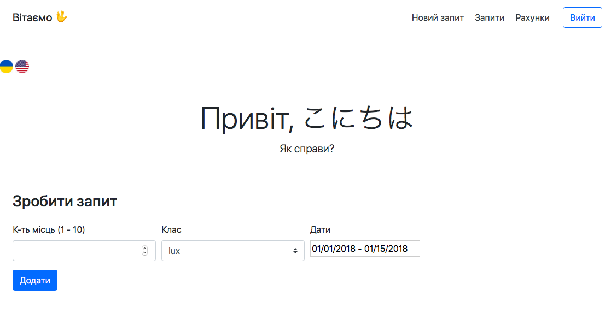

# Hotel Booking Service (Spring)

 Система Заказ гостиницы. Клиент заполняет Заявку, указывая количество мест в номере, класс апартаментов и время пребывания. Администратор просматривает поступившую Заявку, выделяет наиболее подходящий из доступных Номеров, после чего система выставляет Счет Клиенту. 

## Status
 - Dokerization (In progress)
 - Deploying on Heroku (In progress)
 - Cleancoding

## Установка

Шаг 1. Скачайте репозиторий
Шаг 2. База данных.
```
mysql -u root -p < src/main/resources/data.sql
```
Создается новый пользователь и база данных. 
Также в базе данных будут созданы два пользователями приложения - admin(пароль - 123) и user(пароль - 123).

## Запуск

```
mvn spring-boot:run
```

Если возникают проблемы с запуском из-за доступа к базе данных (java.sql.SQLNonTransientConnectionException: Public Key Retrieval is not allowed), попробуйте зайти в mysql под новым пользователем (пароль: 12345) и выйти:

```
 mysql -u newuser -p
 mysql> exit
 Bye
```


В случае успешного запуска, сайт будет отображаться на порту 8090:

http://localhost:8090/

## Features

Использовано:
 - Java 8:
   - Streams
   - Optionals
 - Spring:
    - Spring Boot
    - Spring Security
    - Conditionals (disable Spring Security with 'security.enabled=false' configuration)
 - Hibernate
 
 - Front:
    - Thymeleaf + HTML + CSS + Bootstrap
    - HTML 5 new features (data-* attribute)

 - Шаблоны:
        - Шаблонный метод
        - Делегат
        - Builder
        
 - Двуязычный сайт (поддерживает укр и англ; язык по умолчанию - укр)
 - Поддерживает интернациональные имена пользователей：
    - Хранение в базе данных:
    
        
    - Авторизация на сайте: 
    
        
        
        
 - Password encrypted (BCrypt)
 - JUnit, Mockito
